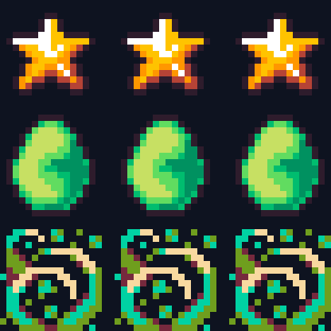
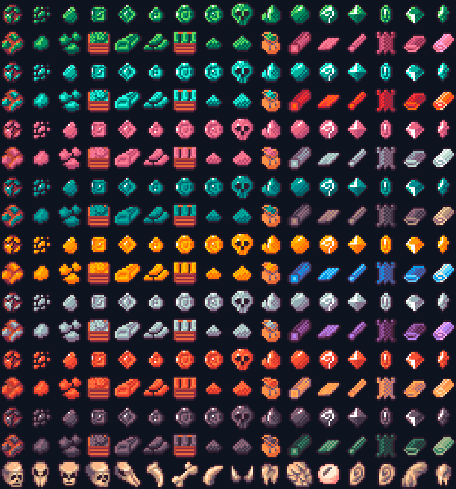
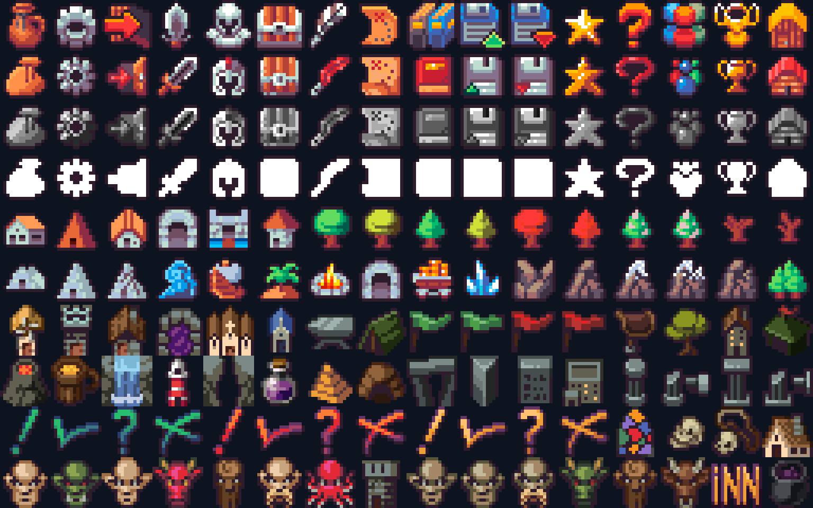
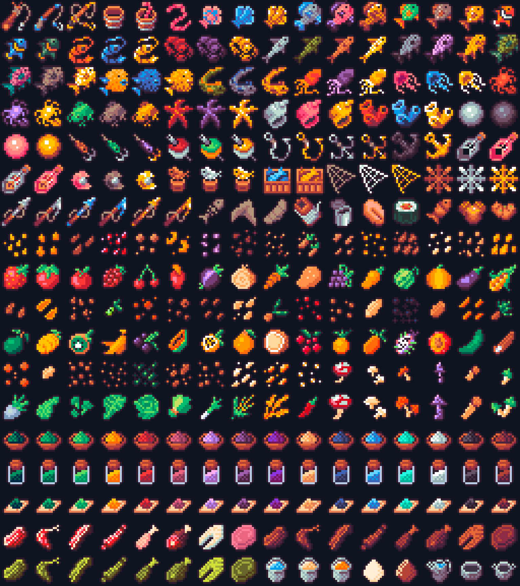
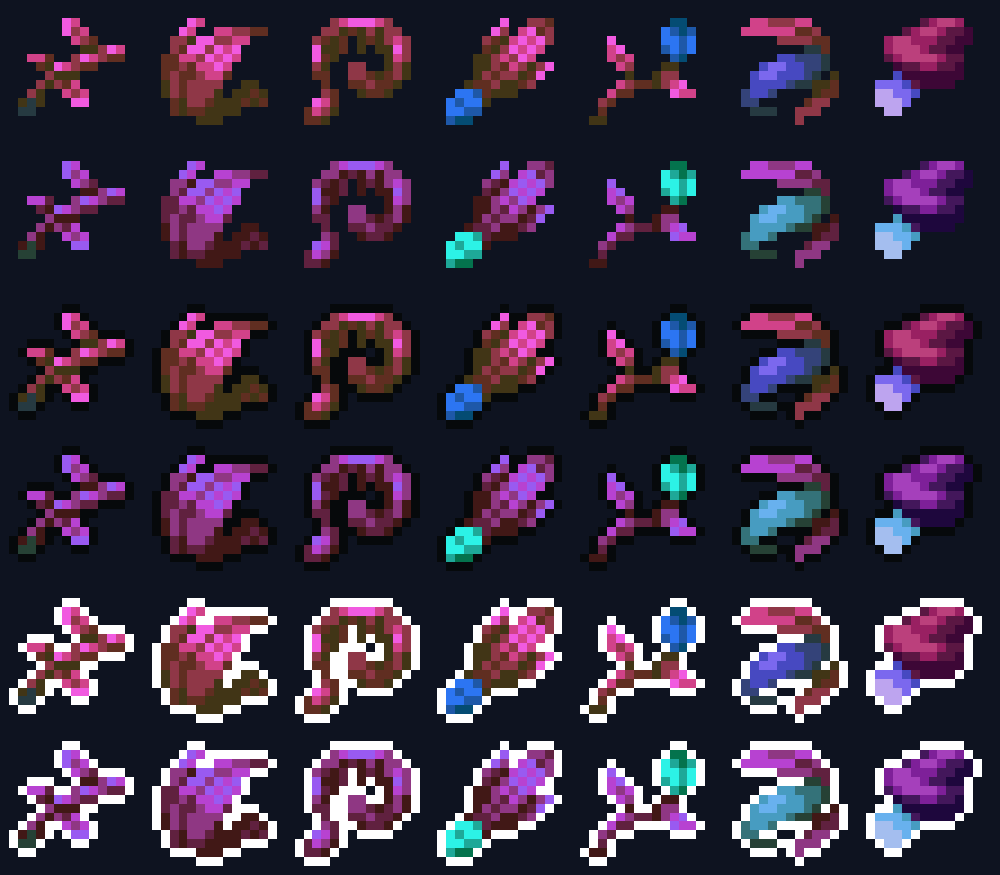
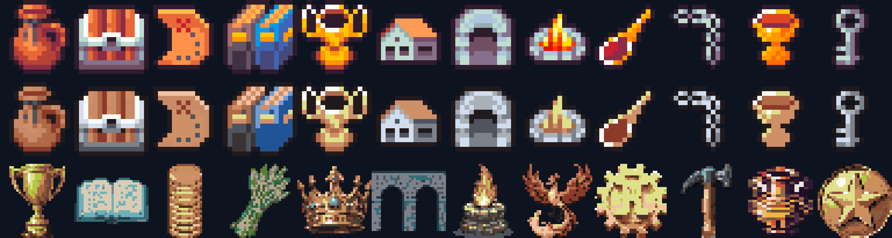
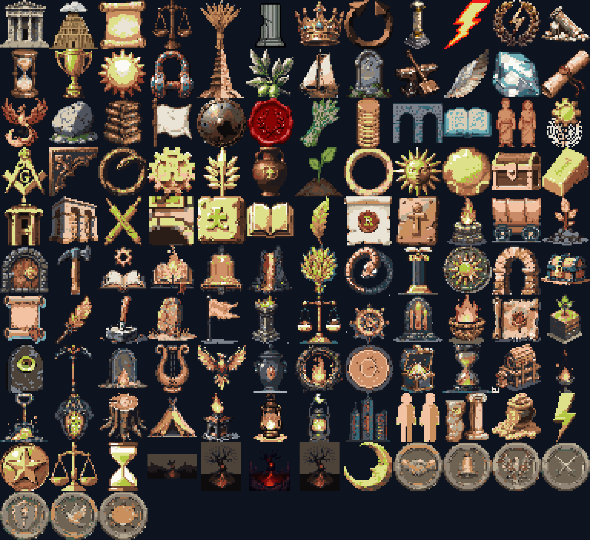

# Raven Fantasy Icons — ce qu'il y a dans les deux archives, et ce que ça vaut ici

**Date** : 2026-07-31
**Question posée** : « qu'en penses-tu ? quels packs peuvent être utiles pour les icônes ?
car je veux toutes les refaire »
**Matière examinée** : les deux `.zip` déposés à la racine du dépôt (ignorés par git via `/*.zip`),
plus la page de la collection lue dans un vrai navigateur.

> **Rien n'a été téléchargé.** Les archives étaient déjà sur le disque ; elles ont été lues
> sans extraction complète, et seules quelques planches ont été sorties dans le bac à sable.

---

## 0. Réponse courte

**Ne refais pas tes 204 icônes avec ce pack.** Trois raisons mesurées, détaillées plus bas :

1. **Il n'y a qu'une seule taille dessinée : 16×16.** Les dossiers `32` et `64` sont un
   agrandissement mécanique — *zéro* pixel de différence (§ 2). Ton jeu, lui, dessine
   `@16 / @24 / @32 / @48` séparément.
2. **72 % du pack est de l'armement et des sorts.** La catégorie la plus proche de ton besoin,
   « Map and UI », fait **160 icônes sur 8 048**, soit 2 % (§ 3).
3. **Le style est l'inverse du tien** : contour dur prune-noir et couleurs saturées, contre ton
   relief peint sans contour en terre cuite (§ 5). L'adopter, c'est troquer une identité pour
   le look d'icône RPG le plus répandu d'itch.io — exactement le piège Kenney déjà nommé au
   § 5.4 de [`AUDIT-BOUTONS-IDENTITE.md`](AUDIT-BOUTONS-IDENTITE.md).

**Ce qui, en revanche, mérite un téléchargement** : les **deux kits Menu/GUI/HUD** de la
collection, que tu n'as pas encore pris. Ce sont les seuls à servir le chantier réellement
bloqué — le chrome des boutons — et ils ne sont **pas** dans l'archive que tu as déjà (§ 7).

---

## 1. Ce que tu as réellement sur le disque

Ce ne sont pas deux dossiers mais **deux archives**, à la racine :

| Fichier | Taille | Entrées |
|---|---|---|
| `Premium - Raven Fantasy Icons.zip` | **98,8 Mo** | 25 493 |
| `Raven Fantasy - Pixel Art RPG Icons - Pets and Animals.zip` | 0,3 Mo | 299 |

### 1.1 L'archive Premium est une poupée russe

Elle contient **six autres `.zip`**, dont deux très gros. Personne ne le voit en l'ouvrant.

```
Premium - Raven Fantasy Icons/
├── Full Spritesheet/           16x16.png · 32x32.png · 64x64.png
├── Separated Files/            16x16, 32x32, 64x64 — 8 256 fichiers chacun
├── New updates/
│   ├── Epic Weapons 3/         193 icônes × 3 tailles
│   ├── Trees and Logs/          37 icônes × 3 tailles
│   └── 4 .zip de compétences   Acolyte 257 · Rogue 257 · Wizard 257 · Warrior 289
├── Old Files/
│   ├── 5600+ Ultimate ….zip    52 Mo — 5 616 icônes × 3 contours × 4 tailles = 67 405 fichiers
│   └── Raven Fantasy Icons.zip 35 Mo — 8 048 icônes × 4 tailles + 6 planches de CATÉGORIE
└── RPG Maker MV and MZ/        planches pour RPG Maker + Read Me
```

**Le zip le plus utile est enterré** : `Old Files/Raven Fantasy Icons.zip` est le seul à porter
un dossier `Categories/`, c'est-à-dire la seule information sémantique de tout l'achat. Il a
aussi le seul **24×24** de la lignée principale — la taille que ton jeu utilise pour la nav.

### 1.2 Les noms de fichiers ne veulent rien dire

`a1.png` … `a8256.png`. Rien d'autre. Le préfixe encode seulement la taille :

| Préfixe | Taille | Même index = même icône |
|---|---|---|
| `a` | 16×16 | `a1234`, `b1234`, `c1234` sont la même icône |
| `b` | 32×32 | |
| `c` | 64×64 | |

**Conséquence pratique** : impossible de chercher une icône par son nom. Le seul moyen de s'en
servir est de **regarder une planche** et de relever la position dans la grille (16 colonnes),
puis d'en déduire l'index. C'est un coût de tri réel, à provisionner avant toute décision
d'adoption.

---

## 2. Le fait qui décide de tout : **une seule taille est dessinée**

La page de vente annonce « A 16x16, 32x32 and 64x64 icon pack ». Mesuré, c'est faux : les
tailles supérieures sont un agrandissement au plus proche voisin du dessin 16×16.

Méthode : agrandir le 16 px et comparer **pixel à pixel** au fichier livré.

| Pack | 16 → 24 | 16 → 32 | 16 → 64 |
|---|---|---|---|
| Premium (lignée principale) | *(pas de 24)* | **0,00 %** | **0,00 %** |
| 5600+ Ultimate (Classic) | **0,0 %** (règle `round`) | **0,00 %** | **0,00 %** |
| Pets and Animals | *(pas de 24)* | **0,00 %** | **0,00 %** |

Testé sur 3 icônes par pack, 3 packs, 4 rapports de taille. Le 24 px sort à 0,0 % dès qu'on
prend la bonne règle d'arrondi (`round` au lieu de `floor`) : c'est un rééchantillonnage
mécanique, pas une main.



**Ce que ça coûte concrètement ici** :

- Ton jeu affiche des icônes à **16, 24, 32 et 48** px, et il a payé cher la leçon
  « dessiner à la taille cible » (fiche *Icônes UI écrasées en 16px*). Poser une icône Raven
  en `@32` donne des **pixels doublés** ; en `@48`, des pixels triplés et non alignés.
  À côté d'une icône maison dessinée nativement à 32, ça ne tient pas.
- **Les deux tiers des 98,8 Mo sont de la redondance.** Si tu extrais, seul le dossier `16x16`
  a un intérêt ; `32x32` et `64x64` sont reconstructibles en une ligne.

C'est aussi la bonne nouvelle : **le pack est un pack 16 px, et à 16 px il est excellent** —
contour dur, silhouette nette, c'est ce qui se lit le mieux à cette taille. Si un jour tu veux
renforcer ton palier `@16`, c'est là qu'il faut regarder.

---

## 3. Le contenu, catégorie par catégorie

Relevé sur les 6 planches `Categories/32x32` (grille de 16 colonnes) :

| Catégorie | Icônes | Part | Utile pour Civilisation Éternelle ? |
|---|---:|---:|---|
| Weapons and Equipment | **3 808** | 47 % | ❌ épées, armures, casques, boucliers |
| Skills and Spells | **1 984** | 25 % | ❌ magie fantasy (quelques auras récupérables) |
| Loot and Treasure | 1 088 | 14 % | ✅ **la meilleure** — voir § 3.1 |
| Sea and Food | 576 | 7 % | ✅ nourriture, pêche, cultures |
| Alchemy and Potions | 432 | 5 % | ⚠️ herbes et fioles ; jarres réutilisables |
| **Map and UI** | **160** | **2 %** | ✅ mais minuscule — voir § 3.2 |
| **Total** | **8 048** | | |

**72 % du pack ne servira jamais à un jeu de civilisation.** Ce n'est pas un défaut du pack —
il est vendu comme un pack de RPG — mais ça change le calcul : tu as acheté 8 000 icônes, tu
en as environ **2 200 exploitables**, et parmi elles très peu portent ton vocabulaire.

### 3.1 « Loot and Treasure » — la vraie trouvaille

C'est la catégorie qui parle ta langue : amphores, calices, coupes, clés, torches, lanternes,
livres, parchemins, sacs, coffres, cadenas, chopes, plumes, rondins, enclume, **balance**,
bols, pièces, lingots, gemmes.

Et surtout une **échelle de matières complète**, déclinée en ~12 coloris : minerai brut →
éclats → tas → caisse → lingot → lingots empilés → plaque → barre → tôle pliée.



C'est exactement la forme d'une **échelle de ressources par ère** (pierre → cuivre → bronze →
fer → acier). Si tu ajoutes un jour des matières par ère, la matière première est là, prête,
et cohérente entre elle. **C'est le seul endroit où ce pack te ferait gagner des semaines.**

### 3.2 « Map and UI » — mal nommée, mais elle cache une idée

160 icônes, et c'est surtout de la **pastille de carte** : bâtiments, tentes, arches, huttes,
arbres, montagnes, cavernes, feux de camp, cristaux, statues, colonnes, ruines, drapeaux,
enclumes, puits, pyramides, marqueurs de quête (`!`, `?`, `X`), portraits d'ennemis.



**Ce qu'il faut lui voler** : les **4 premières rangées** livrent le même jeu d'objets en
quatre teintes — couleur, seconde couleur, **gris désaturé**, **silhouette blanche pleine**.
C'est-à-dire, dans ton vocabulaire : *disponible / actif / **verrouillé** / **masque***.

C'est précisément l'état « verrouillé » qui manque à l'arbre de ruines et aux rangées d'achat.
Note bien : **c'est une idée, pas un asset à prendre.** Un gris désaturé et une silhouette
blanche se produisent en CSS (`filter: grayscale()`) ou en canvas sur *tes* icônes. Tu n'as pas
besoin d'importer les leurs pour t'en servir.

### 3.3 Le reste

- **Sea and Food** (576) : poissons, coquillages, poulpes, fruits, légumes, champignons,
  viandes, paniers, **bols et bocaux d'une même denrée** — la série « bol de X » est propre et
  se prête bien à une jauge de stock.
  
- **Pets and Animals** (96) : animaux de compagnie fantasy. Sans emploi ici.
- **Les 4 packs de compétences** (1 060) : magie de classe RPG. Sans emploi.
- **Epic Weapons 3** (193), **Trees and Logs** (37) : les arbres et rondins peuvent nourrir
  une ressource « bois », le reste non.

---

## 4. Trois palettes dans le même achat — elles ne se mélangent pas

Mesuré avec la même méthode que le § 8 ter de l'audit des boutons (luminance pondérée,
part de pixels froids, dominantes), pour que les chiffres soient comparables.

| Planche | Couleurs | Luminance | Froid | Contour dominant |
|---|---:|---:|---:|---|
| Raven — Map and UI | 226 | 0,391 | 18,3 % | `#2E1C2C` (30,0 %) |
| Raven — Loot and Treasure | 232 | 0,390 | 25,2 % | `#2E1C2C` (31,9 %) |
| Raven — Sea and Food | 166 | 0,398 | 17,1 % | `#2E1C2C` (32,6 %) |
| Raven — planche complète 32×32 | 1 393 | 0,396 | 28,6 % | `#2E1C2C` (27,8 %) |
| **5600+ Ultimate — Classic** | **8 663** | 0,417 | 49,3 % | *aucun* (contour par objet) |
| **5600+ Ultimate — Dark** | 8 678 | 0,292 | 65,8 % | `#06090B` (**34,0 %**) |
| **5600+ Ultimate — Light** | 8 678 | 0,607 | 33,3 % | `#FFFFFF` (**33,4 %**) |
| **Pets and Animals** | 77 | 0,435 | 54,7 % | `#28252F` — palette **Resurrect 64** |
| *(repère : fond de l'app `#0E1320`)* | | *0,010* | | |

**Trois lignées distinctes, trois contours différents.** Les mélanger se verrait :

- La **lignée principale** (8 048 + les mises à jour) : contour unique `#2E1C2C`, un prune-brun.
  Cohérente avec elle-même, chaude.
- Le **5600+ Ultimate** : 8 663 couleurs, aucun contour unifié en variante *Classic*. C'est un
  pack plus ancien et bien plus lâche. Ses variantes *Dark* et *Light* ajoutent un liseré
  uniforme.
- **Pets** : encore une autre palette (Resurrect 64, de Kerrie Lake, documentée sur Lospec).

### Les trois contours, sur ton fond de nuit



- **Dark** pose un liseré `#06090B` sur **34 % des pixels**. Sur ton `#0E1320` (luminance
  0,010), ce noir **disparaît dans le fond** : l'icône perd son bord et bave sur le panneau.
  À écarter ici, malgré son nom rassurant.
- **Light** pose du blanc pur sur **33,4 %** des pixels. Ça claque, mais un tiers de l'icône
  devient blanc — ça se bat frontalement avec `--brand-gold` et ça donne un look d'autocollant.
- **Classic** est le seul dont le contour est une teinte plus sombre de l'objet lui-même.
  C'est celui qui se tient sur fond sombre — et c'est aussi celui de ta lignée principale.

**À retenir** : si tu prends quoi que ce soit dans le 5600+, prends **Classic**.

---

## 5. Est-ce compatible avec ta palette ? Testé, pas supposé

Bonne surprise : **chaque icône prise isolément n'utilise que 4 à 11 couleurs.** Les 226–484
couleurs comptées plus haut sont l'union de toute une planche, pas la charge d'une icône. La
discipline anti-bloat du projet (fiche *Palette maître anti-bloat*, plafond 16–24 teintes) est
donc respectée d'emblée.

J'ai découpé 12 icônes et les ai passées à l'outil du projet :

```bash
node scripts/remapPalette.mjs <icone.png> --epoch marbre --max 22
```

Résultat : 4–11 teintes en entrée → **4–10 teintes en sortie**, aucune n'a touché le plafond.



**Lecture de cette image — c'est le cœur du rapport :**

- **Rangée du milieu contre rangée du haut** : le remap **marche**. En une commande, l'orange
  saturé et le bleu vif tombent sur ta terre cuite et ton os. Ce n'est pas une hypothèse,
  c'est la sortie de l'outil.
- **Rangée du milieu contre rangée du bas** : et pourtant **ça reste deux mains différentes.**
  Le remap corrige la *couleur*, pas le *dessin*. Tes icônes sont un relief peint sans contour,
  denses, qui remplissent le cadre. Celles de Raven sont des objets cernés, plus plats, plus
  trapus, avec de larges aplats. Posées côte à côte dans la même barre de ressources, on verra
  la couture.
- Le remap **écrase aussi les accents** : le trophée perd son or, le feu perd son orange. Sur
  une icône dont la couleur *porte du sens* (or = payable, rouge = irréversible), c'est une
  perte réelle, à récupérer au cas par cas avec `--extra`.

### Pour mémoire, tes icônes actuelles



204 concepts distincts, 533 PNG, 7 à 17 couleurs par icône, toutes sur la palette maître.
Le vocabulaire est **très spécifique** : `node-grammaire_des_ruines`, `node-dogma_eternal_return`,
`paxDivina`, `sisyphe`, `epitaph`, `foyers/complexity`… **Aucun pack d'icônes au monde ne
contient ça.** C'est la raison de fond pour laquelle « tout refaire » depuis un pack ne peut
pas fonctionner : la moitié de tes icônes n'ont pas d'équivalent achetable.

---

## 6. La licence — dont une clause qui te concerne directement

Lue dans le PDF officiel (*Clockwork Raven General Licence v.1.2*, lien depuis la page itch.io) :

| Point | Verdict |
|---|---|
| Usage commercial, nombre de produits illimité | ✅ autorisé |
| Modifier les assets pour tes besoins | ✅ autorisé (§ 3.c) — le remap est couvert |
| Crédit | ⚪ **non obligatoire**, apprécié — « Clockwork Raven – Additional Art Assets » |
| Revendre / redistribuer les assets tels quels | ⛔ interdit |
| NFT | ⛔ interdit |
| **Entraîner une IA dessus** | ⛔ **interdit** (§ 3.f et FAQ g) |

> ⚠️ **La clause 3.f touche ce projet.** Elle interdit d'entraîner « une machine, une IA ou tout
> logiciel susceptible de produire une œuvre dérivée ou visuellement similaire ». Ce projet
> génère l'essentiel de ses sprites chez **PixelLab**. Passer une icône Raven en image de
> référence, en `edit_image` ou en `inpaint_image` pour en produire des semblables tombe très
> exactement dans ce que la clause vise.
>
> **Ce qui reste sûr** : utiliser les icônes telles quelles, ou les modifier par un traitement
> déterministe (`remapPalette.mjs`, recadrage, recolorage). **Ce qui ne l'est pas** : s'en
> servir comme référence de style pour une génération. En cas de doute, l'auteur répond par
> mail (`caioterci@gmail.com`) — c'est écrit dans la licence.

C'est une contrainte plus serrée que le pack UI Book (qui, lui, exige un crédit mais ne dit
rien de l'IA).

---

## 7. Les ~40 packs de la collection : lesquels prendre ?

La collection *Raven Fantasy Icons — Full Collection* regroupe une quarantaine de packs
(35,50 $ au lieu de 158 $). Tu l'as achetée, donc **tout est déjà téléchargeable gratuitement**.
La seule question est : lesquels valent le disque et le tri ?

### 7.1 À prendre — ils ne sont PAS dans ce que tu as

| Pack | Pourquoi |
|---|---|
| **PixelArt Menu, GUI, HUD and UI Kit — Starter Set** | 🔥 **La priorité.** Panneaux, boutons, barres, cadres. C'est le seul matériau de la collection qui serve le chantier réellement bloqué (le chrome, cf. `AUDIT-BOUTONS-IDENTITE.md`). Rien de tel dans l'archive Premium. |
| **PixelArt Menu, GUI, HUD — Classic** | 🔥 Le second kit, style JRPG classique. À prendre en même temps : deux directions à comparer coûtent le même effort qu'une. |
| **240 Attributes, Menu and States** | ⚠️ Le vocabulaire d'**état** d'interface (verrouillé, actif, alerte, flèches). Recoupe peut-être « Skills and Spells » — je n'ai pas pu le vérifier sans le télécharger. Peu cher en disque, à regarder. |
| **Modern Office** | ⚠️ **Seulement si** la bascule des deux peaux se fait. Vocabulaire moderne pour les ères Néon / Noosphère, absent de tout le reste. |

### 7.2 À ne PAS prendre — déjà dans ton archive Premium

Ces packs sont les **catégories** de l'archive de 8 048 que tu as déjà. Les retélécharger
séparément ne donne rien de plus (et le nommage y est tout aussi muet — vérifié sur *Pets*,
qui numérote `1.png`…`96.png`) :

| Pack séparé | Déjà présent comme |
|---|---|
| Treasure/Currency/Gems and Loot · Jewels and Gems · Crafting Materials · General Items and Tools | catégorie *Loot and Treasure* (1 088) |
| Fishing and Sea · Crops, Food and Drinks · 300+ Farming, Food and Beverages | catégorie *Sea and Food* (576) |
| 280+ Alchemy and Herbs · 150+ Potions | catégorie *Alchemy and Potions* (432) |
| Map Markers · 32 Places and Seasons | catégorie *Map and UI* (160) |
| 400+ Skills and Spells · Attributes/Skills/Spells/Scores · Expanded Skills and Status | catégorie *Skills and Spells* (1 984) |
| Wizard / Warrior / Acolyte / Rogue Skills | les 4 `.zip` dans `New updates/` |
| Tree, Logs and Planks · Epic Weapons 3 | `New updates/` |
| 5600+ Ultimate Pixel Art Fantasy RPG Icon Pack | `Old Files/` (52 Mo) |
| 8000+ Raven Fantasy Icons | c'est **l'archive Premium elle-même** |

### 7.3 À ignorer — hors sujet pour un jeu de civilisation

800+ Weapons · 500+ Armor · 400+ Accessories · 380+ Epic Armory · 160 Fantasy Shields ·
110+ Fantasy Masks · 120+ Fantasy Clothing · 100+ Dark Fantasy Equipment · Equipment Sets ·
Epic Weapons 1 et 2 · 220+ Monster Hunting · Magic and Enchantment Items · Pets and Animals.

**Bilan : sur une quarantaine de packs, 2 à 4 méritent un téléchargement**, et ce sont les
**kits d'interface** — pas les packs d'icônes.

---

## 8. Verdict et recommandation

### Ce que ce pack est

Un très bon pack d'icônes RPG **16 px**, cohérent, propre, à petite charge de couleurs,
sous une licence commerciale confortable. Pour un RPG d'inventaire, c'est un excellent achat.

### Ce qu'il n'est pas

Une base pour refaire les icônes de *Civilisation Éternelle*. La raison n'est pas le goût,
ce sont trois faits mesurés :

1. **Une seule taille dessinée** (16 px), contre quatre paliers natifs chez toi.
2. **Un vocabulaire qui ne recouvre pas le tien** : 72 % d'armement et de sorts, et rien pour
   `dogma_eternal_return`, `paxDivina` ou `grammaire_des_ruines`.
3. **Une autre main** : le remap corrige la couleur, jamais le dessin — la couture reste
   visible (§ 5).

Et un risque de fond, déjà nommé dans l'audit des boutons : ces icônes sont parmi les plus
répandues d'itch.io. Les adopter en bloc reviendrait à échanger « ça ressemble à tous les jeux
Claude » contre « ça ressemble à tous les RPG itch.io ». Le problème de départ était
l'anonymat — pas la laideur.

### Ce que je ferais, dans cet ordre

1. **Télécharger les deux kits Menu/GUI/HUD.** C'est le chantier qui bloque, c'est là que
   l'identité se joue, et c'est le seul matériau vraiment neuf de la collection.
   *(La collection est déjà payée : ça ne coûte que le disque.)*
2. **Garder l'archive Premium en réserve de largeur**, pas en base de style : l'échelle
   minerai → lingot (§ 3.1) et la série « bol de X » (§ 3.3) sont de vrais gains **le jour où**
   tu ajoutes des matières par ère. Pas avant.
3. **Voler l'idée des 4 teintes** (§ 3.2) sans voler les assets : `disponible / actif /
   verrouillé / masque`. Ça se fait sur *tes* icônes, en CSS ou en canvas.
4. **Ne pas extraire les dossiers `32x32` et `64x64`** — ce sont deux tiers de 98,8 Mo de
   redondance, reconstructibles en une ligne depuis le 16.
5. **Poser la clause 3.f dans les contraintes du projet** : jamais d'icône Raven en entrée de
   PixelLab.

---

## Annexe — comment ces chiffres ont été obtenus

Trois scripts jetables, dans `scratch/` (ignoré par git). Ils se relancent tels quels :

| Script | Ce qu'il mesure |
|---|---|
| `scratch/raven-palette.mjs` | couleurs distinctes, luminance pondérée, part de pixels froids, dominantes — même méthode que le § 8 ter de l'audit des boutons |
| `scratch/raven-sizes.mjs` | 16 → 32 / 64 : agrandissement ou redessin |
| `scratch/raven-sizes2.mjs` | idem, étendu au 5600+ Ultimate et à Pets |
| `scratch/raven-sizes3.mjs` | le cas du 24 px (facteur 1,5), les 4 règles d'arrondi |

Les planches de comparaison sont dans [`docs/concepts/icones-raven/`](concepts/icones-raven/),
toutes composées **sur le fond réel du jeu** (`#0E1320`) et agrandies au plus proche voisin.

**Un piège rencontré, à ne pas redécouvrir** : Node résout `node_modules` depuis
l'emplacement du **script**, pas depuis le répertoire courant. Un script de mesure posé dans
le bac à sable ne trouve pas `pngjs` même lancé depuis la racine du dépôt — il doit vivre
sous `C:\Users\Raphi\civilisation-idle\`.
